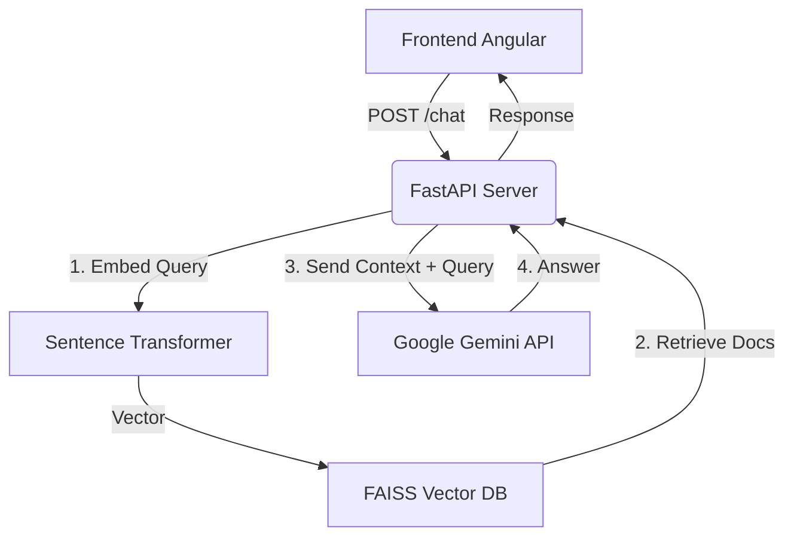

# 🤖 SENTERANGA Hybrid RAG Server (Jokko)

Ce projet héberge le serveur backend pour l'assistant intelligent **Jokko** de la plateforme SENTERANGA. Il utilise une architecture **RAG (Retrieval-Augmented Generation)** hybride :
1.  **Recherche Sémantique Locale** : Utilisation de FAISS et SentenceTransformers pour retrouver instantanément les documents pertinents du projet.
2.  **Génération Cloud** : Utilisation de **Google Gemini 1.5 Flash** pour générer des réponses fluides et intelligentes en français.

## 🌟 Fonctionnalités

*   **Réponses Contextuelles** : L'IA lit la documentation du projet pour répondre aux questions spécifiques.
*   **Performance** : Recherche locale instantanée (<100ms) et génération rapide via Gemini.
*   **Déploiement Facile** : Configuré pour Render, sans besoin de GPU coûteux.
*   **API Simple** : Endpoints REST clairs pour l'intégration avec Angular.

## 🏗️ Architecture Technique



## 📋 Prérequis

*   **Python 3.10+** installé.
*   **Clé API Google Gemini** (gratuite). [Obtenir une clé ici](https://aistudio.google.com/app/apikey).
*   Un compte **Render** (pour le déploiement).

## 🚀 Installation Locale

### 1. Cloner et Préparer

```bash
# Créer un environnement virtuel
python3 -m venv .venv

# Activer l'environnement
source .venv/bin/activate  # Sur Windows: .venv\Scripts\activate

# Installer les dépendances
pip install -r requirements.txt
```

### 2. Configurer l'API Key

Vous devez définir la variable d'environnement `GEMINI_API_KEY`.

```bash
# Linux/Mac
export GEMINI_API_KEY="votre_clé_api_ici"

# Windows (Powershell)
$env:GEMINI_API_KEY="votre_clé_api_ici"
```

### 3. Indexer le Corpus de Documents

Cette étape crée la "mémoire" de l'IA en scannant les fichiers du projet.

```bash
# Indexer le dossier courant (ou spécifiez un chemin)
python index_corpus.py .
```
*Cela va créer un dossier `index_data/` contenant l'index vectoriel.*

### 4. Lancer le Serveur

```bash
python -m uvicorn server:app --host 127.0.0.1 --port 8000 --reload
```

Le serveur sera accessible sur `http://127.0.0.1:8000`.

## 📡 API Endpoints

### `GET /health`
Vérifie l'état du serveur et de l'index.
```json
{
  "status": "OK",
  "index_loaded": true,
  "gemini_configured": true
}
```

### `POST /chat`
Envoyer un message à Jokko.
**Corps de la requête :**
```json
{
  "message": "Comment déployer le projet ?",
  "userContext": {}
}
```
**Réponse :**
```json
{
  "response": "Pour déployer le projet, suivez les étapes...",
  "sources": ["README.md", "README_DEPLOY.md"],
  "backend": "gemini"
}
```

## ☁️ Déploiement sur Render

Pour mettre ce serveur en ligne gratuitement :

1.  **Pousser le code** sur un dépôt GitHub/GitLab.
    *   *Assurez-vous d'inclure le dossier `index_data/` généré dans votre commit* (sinon le serveur ne saura rien).
2.  Créer un **Web Service** sur [Render.com](https://render.com).
3.  Connecter votre dépôt.
4.  **Configuration** :
    *   **Runtime**: Python 3
    *   **Build Command**: `pip install -r requirements.txt`
    *   **Start Command**: `python -m uvicorn server:app --host 0.0.0.0 --port $PORT`
5.  **Environment Variables** :
    *   Ajouter `GEMINI_API_KEY` avec votre clé.

## 📂 Structure du Projet

*   `server.py` : Le cœur de l'application FastAPI.
*   `index_corpus.py` : Script pour transformer vos fichiers en vecteurs FAISS.
*   `index_data/` : Base de données vectorielle (ne pas supprimer si vous déployez).
*   `requirements.txt` : Liste des librairies Python nécessaires.

## 🛡️ Alternative : Mode 100% Hors Ligne

Si vous ne souhaitez pas utiliser l'API Gemini et préférez une exécution locale (avec GPT4All ou LlamaCPP), utilisez le script `server_faiss_only.py`.

1.  **Lancer le serveur alternatif** :
    ```bash
    # Activer le téléchargement auto de modèles (GPT4All)
    export ENABLE_GPT4ALL_DOWNLOAD=1
    python -m uvicorn server_faiss_only:app --host 127.0.0.1 --port 8000
    ```
    *Note: Cela téléchargera un modèle (~4GB) au premier lancement.*

## 🧪 Tests

Un script de test est disponible pour vérifier que tout fonctionne avant déploiement :
```bash
python test_deploy.py
```

---
**Note**: Si vous modifiez la documentation ou le code source, pensez à relancer `python index_corpus.py .` pour mettre à jour les connaissances de l'IA.
